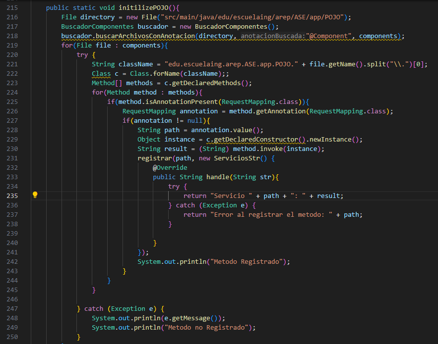
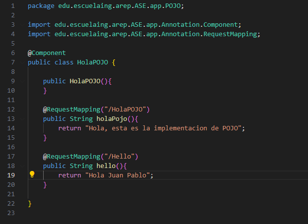
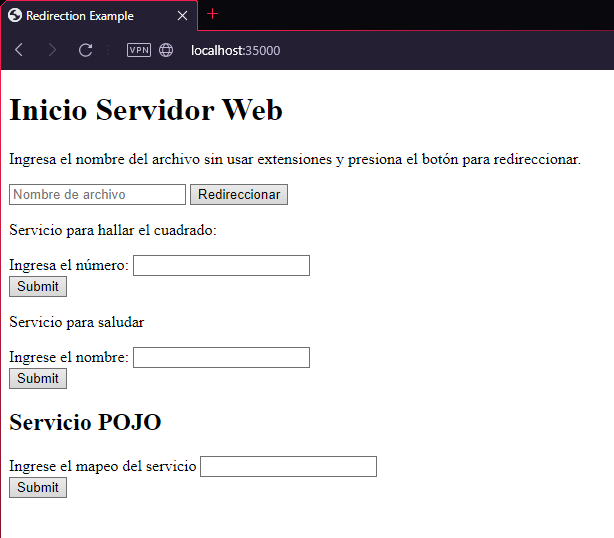
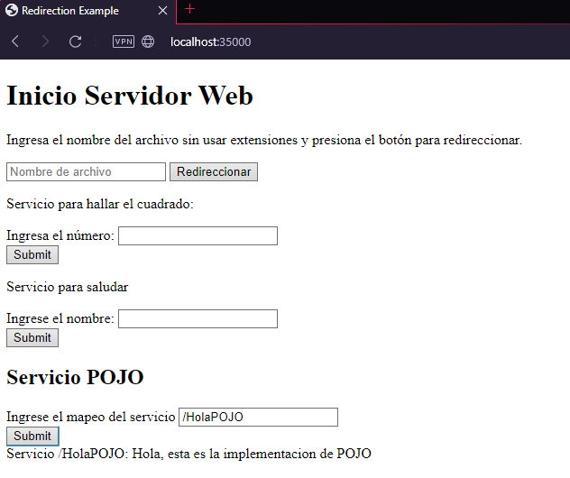
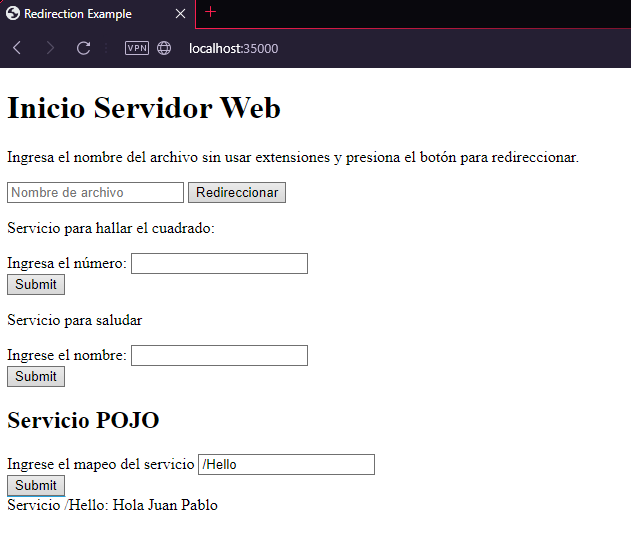

# AREP-Taller-4
En este taller se tuvo como objetivo realizar un servidor web que respondiera a las peticiones de servicios que han sido mapeados usando una Anotacion.

Este taller es una continuacion del primero [AREP Taller 3](https://github.com/JuanPabloDaza/AREP-LAB3).

## Para ejecutar el programa

Se puede hacer uso del comando git clone y usar la URL del repositorio:
```
https://github.com/JuanPabloDaza/AREP-Taller-4
```

## Prerequisitos

Es necesario tener instalado maven para compilar y probar los test del programa, si no se tiene maven puede instalar [aqui](https://maven.apache.org/install.html).

## Instalacion 

Una vez clonado, se debe hacer uso del comando:

```
mvn package
```

Este comando compilara el programa y tambien ejecutara las pruebas. 

## Despliegue del programa:

Para ejecutar el programa se usa el comando:

```
mvn exec:java -D "exec.mainClass"="edu.escuelaing.arep.ASE.app.Spark"
```
Una vez ejecutado se debe acceder a traves de un buscador y con la direccion:
```
127.0.0.1:35000
```

## Descripcion del programa:

### Diseño:

En este programa se usa la clase HttpServer para responder a las peticiones de servicios que se le realicen, en este caso se maneja un POJO con la finalidad de implementar el uso de anotaciones, identificarlas y mapear servicios para que el servidor de respuesta.

### Implementacion:

En la clase HttpServer se implemento un nuevo metodo:<br>

<br>

El cual se encarga de buscar los metodos que tengan la anotacion @RequestMapping y los agrega a un hashmap donde estan los servicios. Tambien hace uso de una clase llamada BuscadorComponentes que se encarga de recorrer el directorio src/main/java/edu/escuelaing/arep/ASE/app/POJO buscando clases que tengan la anotacion @Component para mapear sus metodos.<br>

<br>

Como podemos ver tenemos dos metodos con la anotación entonces vamos a probarlos:<br>

<br>

En el index podemos ver el apartado de Servicio POJO e ingresaremos el metodo que queremos usar de la siguiente forma:<br>

<br>

Y podemos ver que funciona, ahora probaremos con el otro metodo:<br>

<br>


## Construido con:

* [Maven](https://maven.apache.org/) - Manejo de dependecias.

## Autor

* Juan Pablo Daza Pinzón
